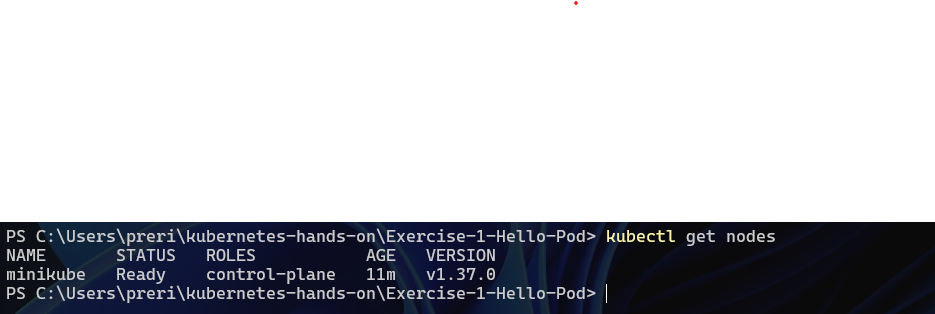
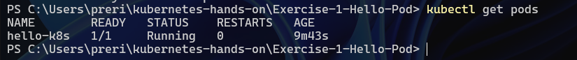
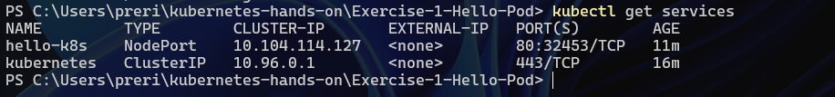
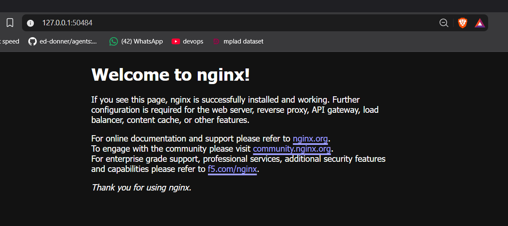

# Exercise 1 — Hello Pod

## Kubernetes Hands-On Exercise Series

This exercise walks through deploying and exposing a simple containerized web application inside a local Kubernetes cluster using Minikube.

The scenario simulates a lightweight **Zepto storefront and delivery-status web app**, represented here using the popular `nginx` container image.

---

## Business Problem (Zepto Example)

Imagine you are a **DevOps Engineer at Zepto**. The product team has just built a lightweight **web app** that shows the **storefront and delivery status page** for customers.

Your task as the DevOps engineer is to **deploy this app on Kubernetes** so that it is:

- Always running
- Portable across environments
- Easy to deploy
- Ready to be scaled later

The `nginx` container image is used to simulate this storefront web app.

---

## Objective

- Set up a local Kubernetes cluster using Minikube.
- Run an Nginx container as a Kubernetes Pod.
- Verify that the Pod is running successfully.
- Expose the Pod using a NodePort Service.
- Access the application through a web browser.

---

## Environment

| Component | Version / Configuration |
|---|---|
| Operating System | Windows 11 Home Single Language |
| Docker | 28.3.3 |
| Minikube | v1.39.0 |
| Kubernetes | v1.37.0 |
| kubectl | v1.32.2 |
| Minikube Driver | Docker |
| Application Image | nginx |

---

## Pre-Requisites

### Install kubectl and Minikube (Windows, via winget)

```powershell
winget install -e --id Kubernetes.kubectl
winget install -e --id Kubernetes.minikube
```

> Docker Desktop must be installed and running, since this exercise uses the **docker** driver.

---

## Steps: Deploy Nginx Image as a Pod

### Step 1 — Start a local Kubernetes cluster with Minikube

```powershell
minikube start --driver=docker
```

### Step 2 — Confirm the cluster is ready

```powershell
kubectl get nodes
```

The `minikube` node comes up in the `Ready` state on the control-plane role, confirming the cluster is up and available to schedule workloads.



### Step 3 — Create the first Pod (using the Nginx image)

```powershell
kubectl run hello-k8s --image=nginx --port=80
```

This creates a single Pod named `hello-k8s` running the `nginx` image and exposing container port 80.

### Step 4 — Verify the Pod is running

```powershell
kubectl get pods
```

The Pod reaches `1/1 Running` with `0` restarts, confirming the container started cleanly and passed its readiness check.



### Step 5 — Expose the Pod as a Service

```powershell
kubectl expose pod hello-k8s --type=NodePort --port=80
```

```powershell
kubectl get services
```

This creates a `NodePort` Service named `hello-k8s`, which maps the cluster-internal port `80` to a randomly assigned high port (`32453` in this run) on the node, making the Pod reachable from outside the cluster.



### Step 6 — Open the app in the browser

```powershell
minikube service hello-k8s
```

Minikube tunnels the NodePort Service to a local address and opens it in the default browser, rendering the Nginx welcome page.



**Congratulations — the first container is deployed and reachable through Kubernetes!**

---

## Manifests

While `kubectl run` and `kubectl expose` were used to create the objects imperatively for this exercise, the equivalent declarative manifests are included for reference and reuse.

**`pod.yaml`**

```yaml
apiVersion: v1
kind: Pod
metadata:
  name: hello-k8s
  labels:
    app: hello-k8s
spec:
  containers:
    - name: hello-k8s
      image: nginx
      ports:
        - containerPort: 80
```

**`service.yaml`**

```yaml
apiVersion: v1
kind: Service
metadata:
  name: hello-k8s
spec:
  type: NodePort
  selector:
    app: hello-k8s
  ports:
    - port: 80
      targetPort: 80
```

Apply them directly with:

```powershell
kubectl apply -f pod.yaml
kubectl apply -f service.yaml
```

---

## What This Demonstrates

- **Pods** are the smallest deployable unit in Kubernetes — here, a single-container Pod running Nginx.
- **Services** decouple networking from the Pod's lifecycle; the `NodePort` type exposes the Pod on a stable, externally reachable port even if the underlying Pod is recreated.
- Kubernetes handles the container lifecycle (scheduling, restarts, health) so the app stays available without manual intervention.
- This pattern — Pod + Service — is the foundation that Deployments, ReplicaSets, and Ingress build on in later exercises to add scaling, self-healing, and routing.

---

## Repository Structure

```
Exercise-1-Hello-Pod/
├── README.md
├── pod.yaml
├── service.yaml
└── screenshots/
    ├── 01-cluster-ready.png
    ├── 02-pod-running.png
    ├── 03-service.png
    └── 04-nginx-browser.png
```
