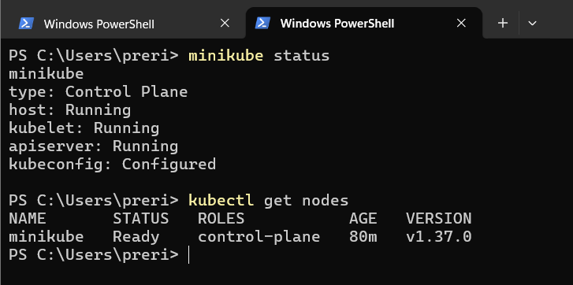
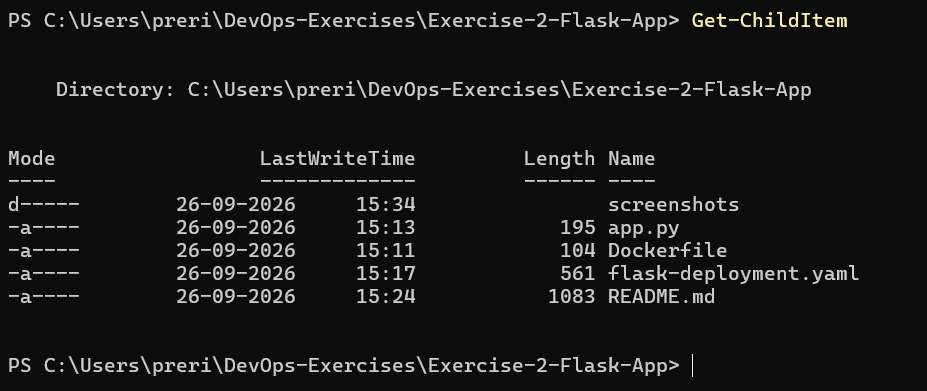
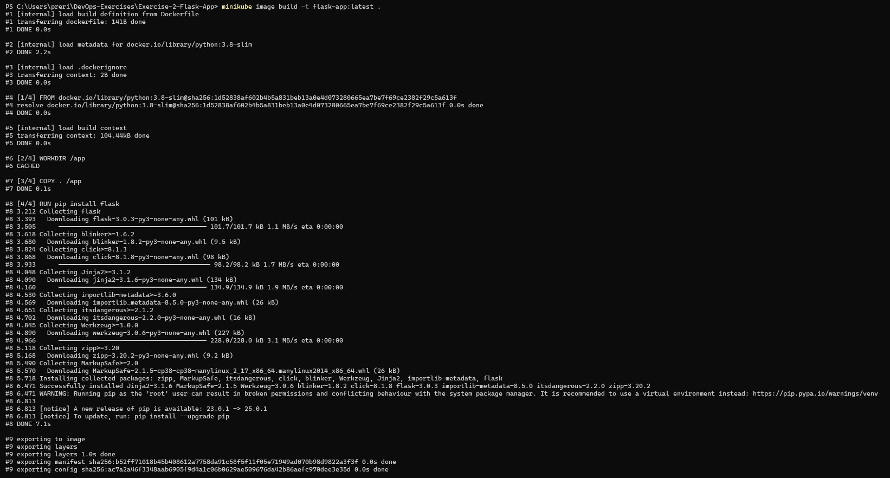
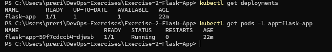
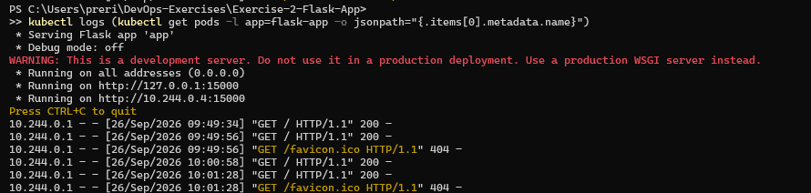
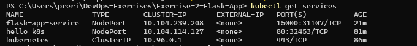
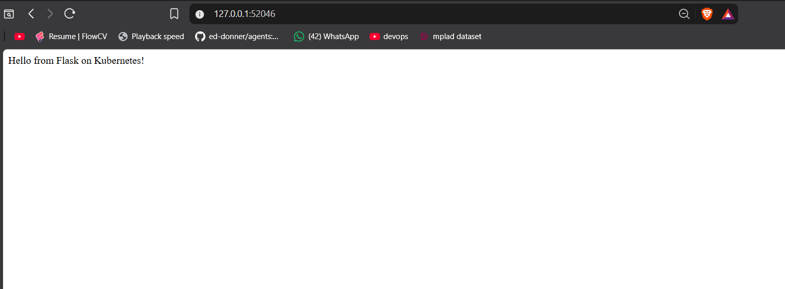
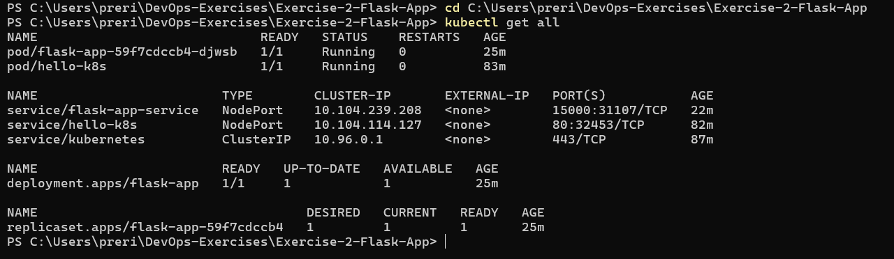

# Exercise 2 — Flask App Deployment

## Kubernetes Hands-On Exercise Series

This exercise moves from a stock `nginx` image (Exercise 1) to a **custom-built application image**. A small Python Flask app is containerized, built directly inside Minikube's own image store, and deployed to the cluster through a Kubernetes `Deployment` and `Service`.

---

## Objective

Deploy a simple Python Flask application on a local Kubernetes cluster using Minikube and Kubernetes YAML configuration.

This exercise demonstrates:

- Creating a Flask application
- Containerizing the application with Docker
- Building the container image directly inside Minikube
- Creating a Kubernetes Deployment
- Running the Flask application inside a Kubernetes Pod
- Inspecting the Deployment and Pod
- Viewing application logs
- Creating a NodePort Service
- Accessing the Flask application through Minikube

---

## Environment

| Component | Version / Configuration |
|---|---|
| Operating System | Windows 11 |
| Minikube | Driver: Docker |
| Kubernetes | v1.37.0 |
| kubectl | v1.32.2 |
| Application | Python Flask |
| Container image | `flask-app:latest` |
| Application port | `15000` |

---

## Steps

### Step 1 — Start and verify Minikube

```powershell
minikube start --driver=docker
minikube status
kubectl get nodes
```

`minikube status` confirms the host, kubelet and apiserver are all `Running`, and the node is `Ready`.



### Step 2 — Lay out the project files

```powershell
Get-ChildItem
```



### Step 3 — Write the Flask app

**`app.py`**

```python
from flask import Flask
app = Flask(__name__)

@app.route('/')
def home():
    return "Hello from Flask on Kubernetes!"

if __name__ == '__main__':
    app.run(host='0.0.0.0', port=15000)
```

### Step 4 — Write the Dockerfile

**`Dockerfile`**

```dockerfile
FROM python:3.8-slim

WORKDIR /app

COPY . /app

RUN pip install flask

CMD ["python", "app.py"]
```

### Step 5 — Build the image directly inside Minikube

Rather than pointing the Docker CLI at Minikube's daemon, `minikube image build` was used — it builds the image straight into Minikube's internal image store, so there's no separate `eval $(minikube docker-env)` step needed.

```powershell
minikube image build -t flask-app:latest .
```



### Step 6 — Define the Deployment and Service

**`flask-deployment.yaml`**

```yaml
apiVersion: apps/v1
kind: Deployment
metadata:
  name: flask-app
spec:
  replicas: 1
  selector:
    matchLabels:
      app: flask-app
  template:
    metadata:
      labels:
        app: flask-app
    spec:
      containers:
      - name: flask-app
        image: flask-app:latest
        imagePullPolicy: Never
        ports:
        - containerPort: 15000

---
apiVersion: v1
kind: Service
metadata:
  name: flask-app-service
spec:
  selector:
    app: flask-app
  ports:
  - port: 15000
    targetPort: 15000
  type: NodePort
```

> `imagePullPolicy: Never` tells Kubernetes to use the image already sitting in Minikube's local store instead of trying to pull `flask-app` from a remote registry, where it doesn't exist.

```powershell
kubectl apply -f flask-deployment.yaml
```

### Step 7 — Verify the Deployment and Pod

```powershell
kubectl get deployments
kubectl get pods -l app=flask-app
```



### Step 8 — Check application logs

```powershell
kubectl logs (kubectl get pods -l app=flask-app -o jsonpath="{.items[0].metadata.name}")
```



### Step 9 — Expose and inspect the Service

```powershell
kubectl get services
```

`flask-app-service` comes up as a `NodePort`, mapping container port `15000` to an externally reachable node port.



### Step 10 — Access the app through the browser

```powershell
minikube service flask-app-service --url
```

Opening the returned URL in the browser renders the Flask response directly.



### Step 11 — Final cluster state

```powershell
kubectl get all
```



The Deployment's ReplicaSet (`flask-app-59f7cdccb4`) is visible here too — this is what actually owns and manages the Pod, something a bare `kubectl run` Pod (Exercise 1) doesn't have.

---

## What This Demonstrates

- **Custom images without a registry** — `minikube image build` compiles the image straight into Minikube's own image store, skipping the extra `eval $(minikube docker-env)` step and any push/pull round-trip.
- **Deployments vs. bare Pods** — unlike Exercise 1's standalone Pod, a `Deployment` creates and owns a `ReplicaSet`, which in turn owns the Pod — giving self-healing and a foundation for scaling (explored in Exercise 3).
- **`imagePullPolicy: Never`** is the setting that makes a locally built image usable without a registry at all.

---

## Repository Structure

```
Exercise-2-Flask-App/
├── README.md
├── app.py
├── Dockerfile
├── flask-deployment.yaml
└── screenshots/
    ├── 01-cluster-ready.png
    ├── 02-flask-files.png
    ├── 03-image-build.png
    ├── 04-deployment.png
    ├── 05-flask-logs.png
    ├── 06-service.png
    ├── 07-flask-browser.png
    └── 08-final-kubernetes-state.png
```
