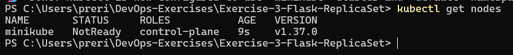
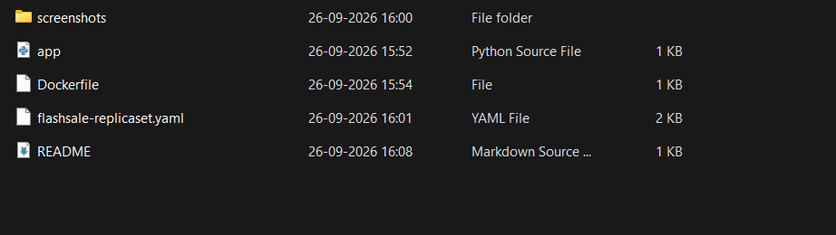
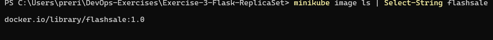
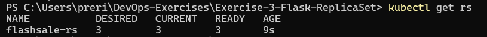
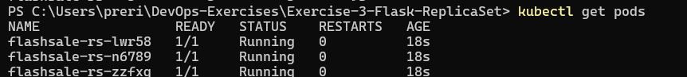
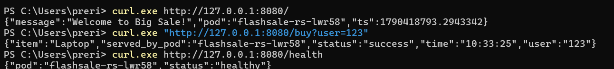
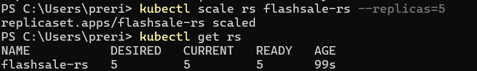
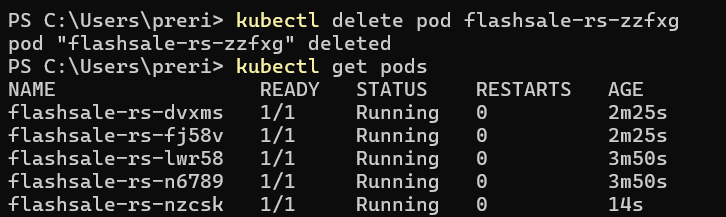
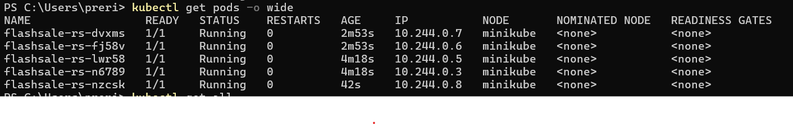
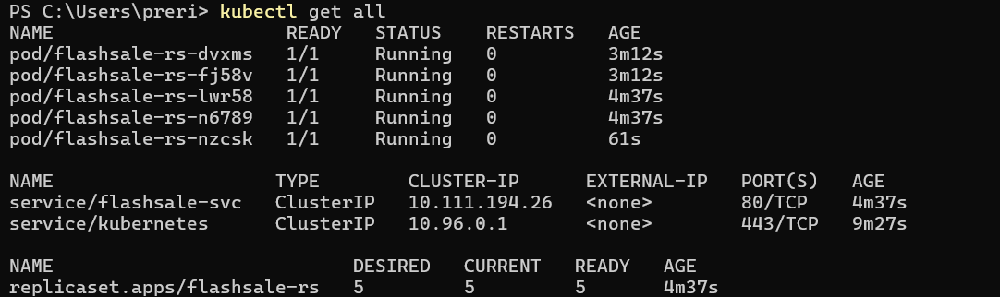

# Exercise 3 — Scaling a Flask App Using ReplicaSets

## Kubernetes Hands-On Exercise Series

This exercise explores how Kubernetes handles **scale and self-healing** using a `ReplicaSet`, going beyond the single-replica Deployment from Exercise 2.

---

## Real-Life Use Case — E-commerce Flash Sale

During a flash sale (e.g. Big Billion Days, Prime Day), traffic can spike from ~100 requests/minute to 10,000+ requests/minute. A single Pod would crash under this load. ReplicaSets let Kubernetes run several identical Pods to distribute traffic, and automatically replace any Pod that fails.

```text
3 replicas → scale to 5 replicas → delete 1 Pod → automatic replacement
```

---

## Objective

- Understand ReplicaSets and Pods.
- Scale a Flask app deployment.
- Observe pod distribution and self-healing.
- Exercise readiness/liveness probes and resource limits.

---

## Environment

| Component | Version / Configuration |
|---|---|
| Operating System | Windows 11 |
| Minikube | Driver: Docker |
| Kubernetes | v1.37.0 |
| Application | Flash Sale Checkout Service (`flashsale:1.0`) |

---

## App: Flash Sale Checkout Service

**`app.py`**

```python
from flask import Flask, request
import socket
import time
import random

app = Flask(__name__)

@app.get("/")
def homepage():
    return {
        "message": "Welcome to Big Sale!",
        "pod": socket.gethostname(),
        "ts": time.time()
    }

@app.get("/buy")
def buy():
    item = random.choice(["Smartphone", "Shoes", "Headphones", "Laptop"])
    user = request.args.get("user", f"user{random.randint(1,1000)}")

    return {
        "status": "success",
        "item": item,
        "user": user,
        "served_by_pod": socket.gethostname(),
        "time": time.strftime("%H:%M:%S")
    }

@app.get("/health")
def health():
    return {
        "status": "healthy",
        "pod": socket.gethostname()
    }

if __name__ == "__main__":
    app.run(host="0.0.0.0", port=5000)
```

Every route echoes `socket.gethostname()`, which is what makes it possible to see *which* replica served a given request further down.

**`Dockerfile`**

```dockerfile
FROM python:3.11-slim

WORKDIR /app

COPY app.py .

RUN pip install --no-cache-dir flask gunicorn

CMD ["gunicorn", "-b", "0.0.0.0:5000", "app:app", "--workers", "1", "--threads", "2"]
```

---

## Steps

### Step 1 — Check the cluster

```powershell
kubectl get nodes
```

The node was captured here right as it came up — still `NotReady` at 9 seconds old, a moment before Minikube finished initializing.



### Step 2 — Lay out the project files

```powershell
Get-ChildItem
```



### Step 3 — Build the image into Minikube and verify it

```powershell
minikube image build -t flashsale:1.0 .
minikube image ls | Select-String flashsale
```



### Step 4 — Define the ReplicaSet and Service

**`flashsale-replicaset.yaml`**

```yaml
apiVersion: apps/v1
kind: ReplicaSet
metadata:
  name: flashsale-rs
  labels:
    app: flashsale
spec:
  replicas: 3
  selector:
    matchLabels:
      app: flashsale
  template:
    metadata:
      labels:
        app: flashsale
    spec:
      containers:
      - name: flashsale-container
        image: flashsale:1.0
        imagePullPolicy: Never
        ports:
        - containerPort: 5000
        readinessProbe:
          httpGet:
            path: /health
            port: 5000
          initialDelaySeconds: 2
          periodSeconds: 5
        livenessProbe:
          httpGet:
            path: /health
            port: 5000
          initialDelaySeconds: 10
          periodSeconds: 10
        resources:
          requests:
            cpu: "100m"
            memory: "128Mi"
          limits:
            cpu: "500m"
            memory: "256Mi"

---
apiVersion: v1
kind: Service
metadata:
  name: flashsale-svc
spec:
  selector:
    app: flashsale
  ports:
  - name: http
    port: 80
    targetPort: 5000
  type: ClusterIP
```

The readiness and liveness probes both hit `/health`, so Kubernetes only routes traffic to Pods that are actually up, and restarts any Pod that stops responding.

```powershell
kubectl apply -f flashsale-replicaset.yaml
```

### Step 5 — Verify the ReplicaSet and initial Pods

```powershell
kubectl get rs
```



```powershell
kubectl get pods
```

3 Pods come up, all `Running`.



### Step 6 — Hit the app through a port-forward

Since `flashsale-svc` is a `ClusterIP` Service (not directly reachable from the host), a port-forward was used to reach it:

```powershell
kubectl port-forward svc/flashsale-svc 8080:80
```

Then from a second terminal:

```powershell
curl.exe http://127.0.0.1:8080/
curl.exe "http://127.0.0.1:8080/buy?user=123"
curl.exe http://127.0.0.1:8080/health
```



Each response includes `served_by_pod` / `pod`, confirming the Service is load-balancing across the ReplicaSet's Pods.

### Step 7 — Scale up to 5 replicas

```powershell
kubectl scale rs flashsale-rs --replicas=5
kubectl get rs
```



Kubernetes brings up 2 additional Pods to reconcile the desired count from 3 to 5 — the same underlying mechanism a flash sale would trigger under real load (typically automated via a Horizontal Pod Autoscaler rather than a manual `kubectl scale`).

### Step 8 — Delete a pod and observe self-healing

```powershell
kubectl delete pod flashsale-rs-zzfxg
kubectl get pods
```



Kubernetes immediately terminates the deleted pod and spins up a replacement (`flashsale-rs-nzcsk`) to maintain the desired replica count of 5.

### Step 9 — Check pod distribution

```powershell
kubectl get pods -o wide
```



All 5 pods run on the single Minikube node (`minikube`), each with a unique internal IP (`10.244.0.x`).

### Step 10 — Final cluster state

```powershell
kubectl get all
```



---

## Key Observations

- **Pod Distribution** — each Pod is an identical worker; scaling creates clones of the app.
- **Resiliency** — deleting a pod triggers automatic replacement, so users see no downtime.
- **Efficiency** — Pods are added under load and removed when demand drops, avoiding over-provisioning.
- **Real-World Parallel** — this is how Netflix, YouTube, and Swiggy scale microservices during peak traffic.

---

## Q&A

**Q1: What is the initial number of replicas?**
A: 3

**Q2: What happens when scaling to 5 replicas?**
A: Kubernetes creates 2 additional pods to reach the desired count of 5.

**Q3: What happens when a pod is deleted?**
A: Kubernetes automatically creates a new pod to replace it, maintaining the desired replica count.

**Q4: How does Kubernetes maintain the desired replica count?**
A: It continuously compares actual running pods to the desired count and creates or deletes pods to reconcile any difference.

**Q5: How many nodes were used?**
A: 1 (single-node Minikube cluster) — all pods scheduled on the same node.

---

## Repository Structure

```
Exercise-3-Flask-ReplicaSet/
├── README.md
├── app.py
├── Dockerfile
├── flashsale-replicaset.yaml
└── screenshots/
    ├── 01-cluster-ready.png
    ├── 02-flask-files.png
    ├── 03-image-build.png
    ├── 04-replicaset-created.png
    ├── 05-three-replicas.png
    ├── 06-flask-endpoints.png
    ├── 07-scaled-to-five.png
    ├── 08-self-healing.png
    ├── 09-pod-distribution.png
    └── 10-final-state.png
```
