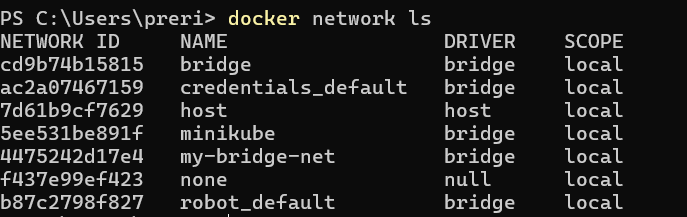
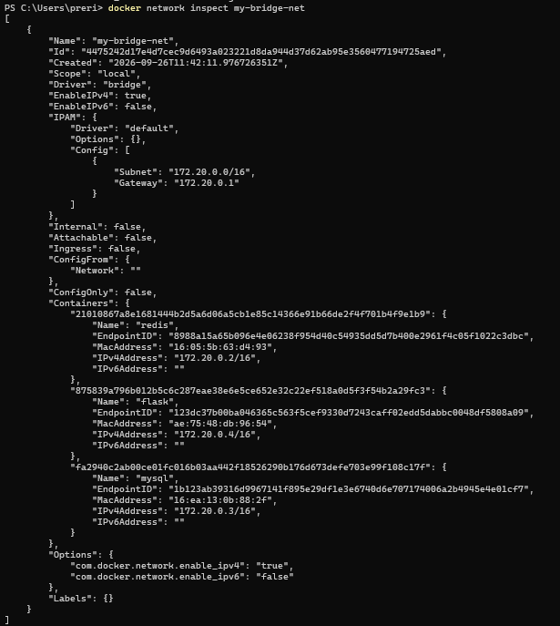
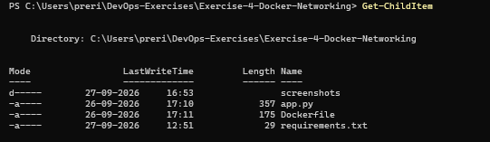
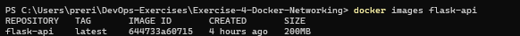
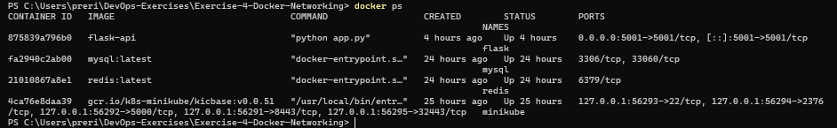
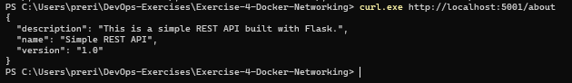
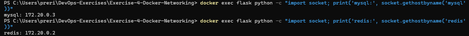
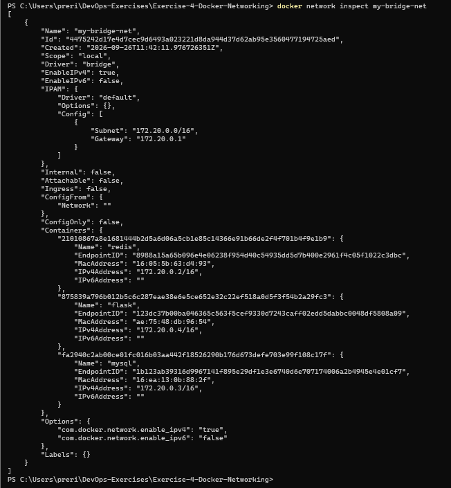

# Exercise 4 — Docker Networking with Multiple Containers

## Kubernetes Hands-On Exercise Series

This exercise steps back from Kubernetes to the layer underneath it — **Docker networking** — and shows how independent containers discover and talk to each other on a shared user-defined network, the same discovery mechanism Kubernetes itself builds on for inter-Pod communication.

---

## Objective

Understand Docker networking concepts and configure a multi-container application where services communicate over a custom bridge network.

---

## Scenario

A small application composed of three containers:
- A Python Flask REST API
- A MySQL database
- A Redis cache

all attached to the same user-defined bridge network, `my-bridge-net`.

---

## Environment

| Component | Version / Configuration |
|---|---|
| Operating System | Windows 11 |
| Network Driver | bridge (user-defined) |
| Application | Flask REST API (`flask-api`) + `mysql:latest` + `redis:latest` |

---

## Steps

### Step 1 — Create and verify the bridge network

```powershell
docker network create --driver bridge my-bridge-net
docker network ls
```

`my-bridge-net` shows up alongside Docker's default networks (`bridge`, `host`, `none`) and Minikube's own network.



### Step 2 — Inspect the network

```powershell
docker network inspect my-bridge-net
```



### Step 3 — Lay out the project files

```powershell
Get-ChildItem
```



### Step 4 — Write the Flask app

**`app.py`**

```python
from flask import Flask, jsonify

app = Flask(__name__)

@app.route('/about', methods=['GET'])
def about():
    return jsonify({
        "name": "Simple REST API",
        "version": "1.0",
        "description": "This is a simple REST API built with Flask."
    })

if __name__ == '__main__':
    app.run(host='0.0.0.0', debug=True, port=5001)
```

**`requirements.txt`**

```
Flask==2.0.1
Werkzeug==2.0.1
```

> **Note:** `Werkzeug` is pinned explicitly alongside `Flask==2.0.1` — newer Werkzeug releases removed an internal function this Flask version depends on (`url_quote`), which otherwise causes an `ImportError` on container startup.

**`Dockerfile`**

```dockerfile
FROM python:3.9-slim

WORKDIR /app

COPY requirements.txt .
COPY app.py .

RUN pip install --no-cache-dir -r requirements.txt

EXPOSE 5001

CMD ["python", "app.py"]
```

### Step 5 — Build the Flask image

```powershell
docker build -t flask-api .
docker images flask-api
```



### Step 6 — Launch all three containers on the bridge network

```powershell
docker run -d --name mysql --net=my-bridge-net -e MYSQL_ROOT_PASSWORD=rootpass mysql:latest
docker run -d --name redis --net=my-bridge-net redis:latest
docker run -d --name flask --net=my-bridge-net -p 5001:5001 flask-api
```

> **Note:** The official MySQL image requires a root password to be set via `MYSQL_ROOT_PASSWORD`, or it refuses to start.

```powershell
docker ps
```



### Step 7 — Test the Flask API from the host machine

```powershell
curl.exe http://localhost:5001/about
```

```json
{
  "description": "This is a simple REST API built with Flask.",
  "name": "Simple REST API",
  "version": "1.0"
}
```



### Step 8 — Test connectivity between containers

The `python:3.9-slim` base image doesn't include `ping`, so name resolution was verified from inside the `flask` container using Python's own `socket` module instead:

```powershell
docker exec flask python -c "import socket; print('mysql:', socket.gethostbyname('mysql'))"
docker exec flask python -c "import socket; print('redis:', socket.gethostbyname('redis'))"
```



Both names resolve successfully, confirming Docker's built-in DNS lets containers on `my-bridge-net` find each other by name.

### Step 9 — Final network state

```powershell
docker network inspect my-bridge-net
```



### Step 10 — Clean up

```powershell
docker stop mysql redis flask
docker rm mysql redis flask
docker network rm my-bridge-net
```

---

## What This Demonstrates

- **User-defined bridge networks** give containers automatic DNS-based discovery by container name — no manual IP wiring needed, as confirmed directly in Step 8.
- **Isolation by default** — containers on `my-bridge-net` can't be reached from the host except through explicitly published ports (`-p 5001:5001`), unlike a host network.
- This is the same discovery model Kubernetes builds on: a Service gives a group of Pods a stable DNS name, the way `my-bridge-net` gives `mysql` and `redis` theirs here.

---

## Q&A

**Q1: What is the purpose of the `--net` flag in `docker run`?**
A: It specifies which Docker network the container should connect to.

**Q2: How do containers communicate with each other on the same network?**
A: Containers on the same user-defined bridge network can resolve each other by container name via Docker's built-in DNS, and communicate over their internal IPs.

**Q3: What is the difference between a bridge network and a host network?**
A: A bridge network isolates containers on a private virtual network, requiring explicit port mapping to reach them from outside. A host network shares the host machine's network stack directly, with no isolation.

**Q4: How can you expose a container's port to the host machine?**
A: Use the `-p` flag, e.g. `-p 5001:5001`, to map a container port to a host port.

---

## Repository Structure

```
Exercise-4-Docker-Networking/
├── README.md
├── app.py
├── requirements.txt
├── Dockerfile
└── screenshots/
    ├── 01-network-created.png
    ├── 02-network-inspect.png
    ├── 03-flask-files.png
    ├── 04-image-build.png
    ├── 05-containers-running.png
    ├── 06-flask-api.png
    ├── 07-container-connectivity.png
    └── 08-final-network-state.png
```
